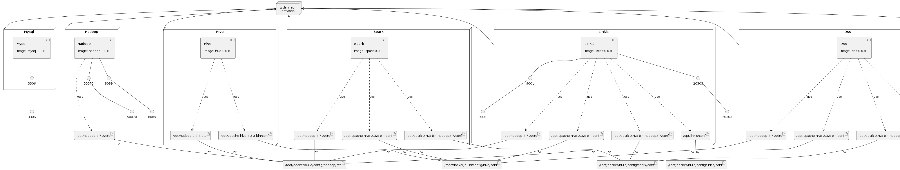

# Docker Compose 运行 WeDataSphere
## 介绍
本项目尝试将 WeDataSphere 运行在 Docker Compose 中，非稳定版。  
推荐使用1.0.x单容器版本  

## 版本要求
docker >17.05  
docker-compose >1.18  
## 推荐硬件
1.0.x 内存 > 16g  
0.9.x 内存 > 25g  
硬盘可用空间 >100g  

## 1.0.x注意事项
容器 schedulis 启动时由于启动脚本只检测10次，会提示异常，需进入容器手工启动schedulis服务  
仅支持x86_64的cpu  
Linkis1.0常见问题和解决办法  https://docs.qq.com/doc/DWlN4emlJeEJxWlR0  

## 0.9.x注意事项
启动容器需要足够的内存和磁盘，否则可能会出现无法启动容器的情况   
仅支持x86_64的cpu  
WeDataSphere 常见问题(含DSS，Linkis) https://docs.qq.com/doc/DSGZhdnpMV3lTUUxq  

## 容器化版本下载
1.0.x k8s https://github.com/apache/incubator-linkis/pull/1219

https://github.com/apache/incubator-linkis/tree/bd73ad1b7621d0b89256710db4186829dd4048e4

1.0.x docker compose https://www.aliyundrive.com/s/xDrqek49ikH 扩展名改为zip  
1.0.x单容器(推荐) 链接: https://pan.baidu.com/s/1Fk-XPVPU7fvhwwFJhrbHSA 提取码: 9pvb  
0.9.x单容器 链接：https://pan.baidu.com/s/1aF9DqV6cEra_cA9ctuXrBA 提取码：a9mj    
0.9.x官方k8s https://github.com/WeBankFinTech/Linkis/blob/dev-0.12.0/k8s/README.MD   

## 原始版本  
https://osp-1257653870.cos.ap-guangzhou.myqcloud.com/WeDatasphere/DataSphereStudio/1.0.0/DSS-Linkis%E5%85%A8%E5%AE%B6%E6%A1%B620210831.zip  

## 官方地址
https://github.com/WeBankFinTech/DataSphereStudio/releases  

## 鸣谢
史寿伟的项目https://gitee.com/sswater/dss-docker-script  
熊本人的版本https://pan.baidu.com/s/1aF9DqV6cEra_cA9ctuXrBA 提取码：a9mj 

### Infrastructure model

